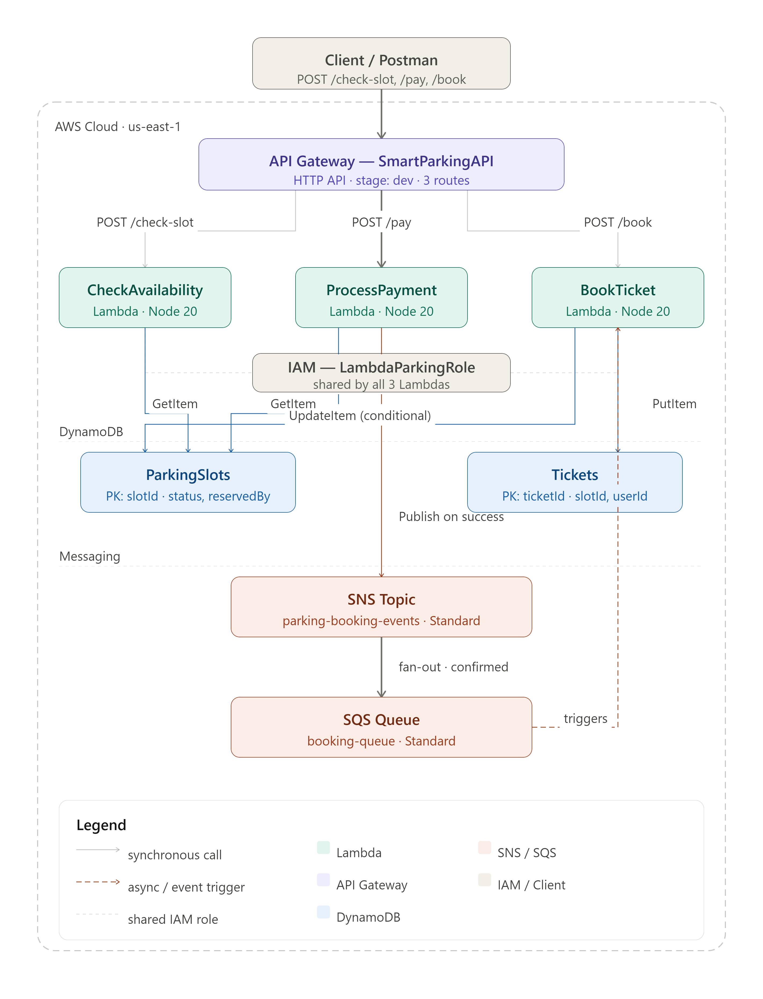

# 🅿️ SmartPark – Intelligent Parking System

A modern, responsive Smart Parking System frontend built with React + Tailwind CSS.

## 🏗️ Architecture



The backend uses a serverless AWS architecture:
- **API Gateway** routes requests to three Lambda functions (`CheckAvailability`, `ProcessPayment`, `BookTicket`)
- **DynamoDB** stores `ParkingSlots` and `Tickets` tables
- **SNS → SQS** handles async booking confirmation events
- A shared **IAM role** governs Lambda permissions across all three functions

---

## 🚀 Quick Start

```bash
# 1. Install dependencies
npm install

# 2. Start development server
npm start
# or
npm run dev  
```

Open [http://localhost:3000](http://localhost:3000) in your browser.

---

## 🔑 Demo Credentials

| Role   | Email                  | Password     |
|--------|------------------------|--------------|
| Driver | any@email.com          | any password |
| Admin  | admin@smartpark.in     | any password |

---

## 📁 Project Structure

```
src/
├── components/          # Reusable UI components
│   ├── common/          # Shared components
│   ├── driver/          # Driver-specific components
│   ├── admin/           # Admin-specific components
│   └── parking/         # Parking grid/map components
├── pages/               # Page-level components
│   ├── driver/          # Driver pages
│   └── admin/           # Admin pages
├── layouts/             # DriverLayout, AdminLayout
├── hooks/               # Custom React hooks
├── context/             # AppContext (global state)
├── routes/              # Route configuration
├── assets/              # Static assets
├── data/                # Mock data (mockData.js)
├── styles/              # Global CSS
├── utils/               # Utility functions
└── App.jsx              # Root component
```

---

## 📱 Screens

### Driver Portal
- **Landing Page** – Hero, features, live slot preview
- **Login / Register** – Auth forms with vehicle details
- **Dashboard** – Stats, reservations, nearby locations
- **Parking Availability** – Real-time grid (green/red/yellow)
- **Parking Map** – Interactive floor plan with zoom
- **Reservation** – Slot booking with countdown timer
- **Booking Confirmation** – QR code ticket, download/navigate
- **Notifications** – Real-time alerts and reminders
- **Booking History** – Table with filters + CSV export
- **Profile** – Vehicle details, payment methods

### Admin Portal
- **Admin Dashboard** – Occupancy stats + Chart.js charts
- **Reports Page** – Weekly tables, donut chart, export PDF/CSV

---

## 🛠️ Tech Stack

| Layer       | Technology              |
|-------------|-------------------------|
| Framework   | React 18                |
| Styling     | Tailwind CSS (CDN)      |
| Routing     | React Router v6         |
| State       | Context API             |
| Charts      | Chart.js + react-chartjs-2 |
| Icons       | Lucide React            |
| Data        | Mock JSON (no backend)  |

---

## ✨ Features

- ✅ Fully responsive (mobile-first)
- ✅ Role-based routing (Driver / Admin)
- ✅ Live parking slot grid with color states
- ✅ Countdown timer on reservation page
- ✅ QR code placeholder on booking confirmation
- ✅ Download ticket as text file
- ✅ Export booking history as CSV
- ✅ Print/PDF report from admin
- ✅ Chart.js charts for admin analytics
- ✅ Smooth animations and transitions
- ✅ Dark theme, smart city aesthetic
- ✅ No backend required

---

## 📦 Env Setup

```bash
cp .env.example .env
# Edit .env as needed (optional – app works without it)
```

---

## 🏆 Hackathon Notes

This project is a **frontend-only demo** using mock data and local state. 
All interactions are simulated. Ready to connect to a real backend API by 
replacing mock data calls with `fetch`/`axios` in `AppContext.jsx`.

---

Built with ❤️ for hackathons and smart city demos.
